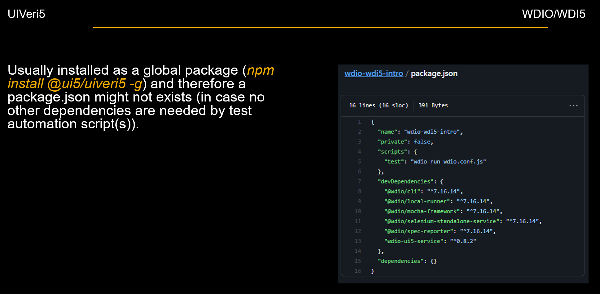

# Migration Guide
This guide describes how to migrate existing UIVeri5 tests to WDIO + WDI5.

First, both UIVeri5 and WDI5 utilize [UI5’s test API](https://ui5.sap.com/#/api/sap.ui.test). This is why even UIVeri5 got deprecated it will still notice changes in UI5 controls. However, new planned features like parallel executions, etc. are not progressed any further.
On long term and especially when new test scripts are developed, the successor (WDIO + WDI5) should highly be considered.

The following list gives an overview about the steps necessary to migrate:
1. Adjust/Create **package.json** (dependencies)
2. Setup configuration file (wdio.conf.js)
3. Adjust authentication logic
4. Adjust test implementation to fit WebdriverIO format
5. Enhancements / Plugins

# 1. Package.json
Usually, the package.json file of an WDIO/WDI5 project has more dependencies. WebdriverIO can cover a broader scope of test automation (as it has more features) and the core of the module is splitted into different modules which need to be installed separately. UIVeri5 has packed the most important features in one module and therefore usually needs only a small package.json file or in case of global installation (npm install @ui5/uiveri5 -g) it can even completely be skipped.

The following image shall give you a first impression about how a typical WebdriverIO package.json can look like:



Short description of dependencies in the picture above:
 - **@wdio/cli**: WebdriverIO testrunner command line interface
 - **@wdio/local-runner**: A WebdriverIO runner to run tests locally 
 - **@wdio/mocha-framework**: WDIO supports different frameworks (mocha, jasmine and cucumber)
 - **@wdio/selenium-standalone-service**:  Sets up all required WebDrivers for you. See [here](./EXAMPLES.md#cross-browser-testing) for more information
 - **@wdio/spec-reporter**: A WebdriverIO plugin to report in spec style. More advanced (graphical) reporters exists as well
 - **wdio-ui5-service**: WebdriverIO plugin to test UI5 applications. See [here](https://github.com/js-soft/wdi5) for more information.
 - ... many other dependencies are possible

# 2. Setup configuration file
You can use the wdio console-based wizard to configure the wdio.conf.js. It will also add the necessary package references in your package.json. If you choose the jasmine or mocha for test syntax, the migration would be easiest.


``` bash
$> npm i --save-dev @wdio/cli
$> npx wdio config
```
Then add wdio-ui5-service to dev dependecy in package.json:
``` bash
$> npm install wdio-ui5-service --save-dev
```
You also need to add 'ui5' service in services in wdio.conf.js
``` javascript
services: [
    // other services like 'chromedriver'
    // ...
    'ui5'
]
```
Add the mimimum configuration for this service somewehere in wdio.conf.js.
``` javascript
wdi5: {
    screenshotPath: path.join('wdio-ui5-service', 'test', 'report', 'screenshots'),
    logLevel: 'verbose', 
    platform: 'browser', 
    url: 'index.html',
    deviceType: 'web',
},
```

# Page Objects
UIVeri5 has a global helper method createPageObjects() for defining "heavy-weight" Page Objects, derived from OPA5. This method adds the content of the actions:{} to the global When clause and the assertions:{} to the Then clause. With WDIO there is no explicit support for BDD style POs but you can handle it very simmilarly. Just export a 'flat' object with all logical actions and assertions from the PO module. Import this PO under a specific name where ever you need it and call the methods in your spec.

# Startup

## baseUrl
UIVeri5 supports both declarative and imperative styles for opening the test page. In WDIO you can have only imperative style but you also need to configure the URL of the app in the configs in simmilarly-named baseUrl property. But there you need to have only the path and the name of  the html file goes in to wdi5.url as shown above.
In your test, you need to explicitly load the app html. Use the wdi5-supplied goTo() method that loads the app page but also injects the WDI5 instrumentation in the loaded UI5 app.
``` javascript
browser.goTo('#/');
```
If the frontpage of your system is not using UI5, use browser.go() and later, when you reach the UI5 app just call injectUI5() to boostrap the UI5 WDI5 instrumentation in the UI5 runtime.
``` javascript
browser.go('#/')
...
// require the service implementation and instantiate separately
const _ui5Service = require('wdio-ui5-service').default;
const wdioUI5Service = new _ui5Service();
wdioUI5Service.injectUI5();
```

## Authentication
There is no explicit support for authentication flows in WDIO so you need to code the login interactions in your test script. Make sure to use only WDIO-level APIs, that is basically everything except browser.byControl().

## Selecting controls
UIVeri5 uses the Protractor-derived [elemement()](https://www.protractortest.org/#/api) API to synchronize the test with the UI5 runtime and to find the DOM element, corresponding to the requested control. In WDI5, there is a similar method browser.byControl() that synchronzies with UI5, resolves the control and returns a control proxy object. Interactions with this object are transfered to the browser context and vice-versa.
``` javascript
var search = browser.asControl({
    selector: {
        <control selector>
    }
});
```
The control selector, also known as declarative OPA matcher is documented in [OPA5](https://openui5.hana.ondemand.com/api/sap.ui.test.RecordReplay.ControlSelector#overview).

### Suffixes
There is no exlicit spport for suffixes in WDI5 as the returned proxy object corresponds to the whole control. So if you explicitly need only one of the interaction point in a control with several such points, like sap.m.SearchBar, you need to chain anothe selector call.
``` javascript
var search = browser.asControl({
    selector: {
        <control selector>
    }
});
search.getWebElement().$('input[type=search]').setValue('<something>');
```

## Interactions
UIVeri5 does not expose specific interaction API but relies on the usage of WebDriver-backed .click() and sentKeys() methods. With WDIO you have simmilar click() and setValue() methods but due to the WDI5 proxying, you also have the control events-based fireEvent() and its overrides like firePress(). There is also an OPA-backed enterText() that uses UI5 test api to genarate mocked events in the browser runtime. 
For best compatability, you must use the WebDriver-backed events, they are also simplest to migrate from UIVeri5.

### click()
To use the WebDriver-backed click() you need to get the web element that corresponds to the root DOM element of this control.
```javascript
var button = browser.asControl({
    selector: {
        <control selector>
    }
});
button.getWebElement().click();
```
For control events, just call the firePress() on the proxy.
```javascript
var button = browser.asControl({
    selector: {
        <control selector>
    }
});
button.firePress();
```

### sendKeys()
To use the WebDriver-backed setValue() you need to get the web element that corresponds to the root DOM element of this control.
```javascript
var search = browser.asControl({
    selector: {
        <control locator>
    }
});
search.getWebElement().setValue('<value>');
```
For control events, just call the fireEvent overide with the value that the control would have sent based on your interaction
```javascript
var button = browser.asControl({
    selector: {
        <control selector>
    }
});
button.fireSearch({query: 'value'});
```
For OPA-backed events, just call the sendKeys() method.
```javascript
var button = browser.asControl({
    selector: {
        <control selector>
    }
});
button.sendKeys('value');
```

## Assertions
UIVeri5 is working on the DOM level with the idea that the test must work as a user. And a user can only validate something that is visible on the screen e.g. available in the DOM. There is also the .asControl().getProperty('<property name>') method to assert against control properties that can be used for edge cases e.g. hyphyphenated on-screen text that is hard to compare to stable value. 
WDI5 is focused on the UI5 control abstraction and the default is to assert on the control properties.

### Properties
All control API methods are available directly on the proxy object, returned by browser.asControl(). So just call the respective getter.
``` javascript
var header = browser.asControl({
    selector: {
        <control selector>
    }
});
expect(header.getTitle()).toBe(‘<something>’);
```

### List count
The proxy object also exposes a getter for the items agregation so call it and assert on the returned array.
``` javascript
var list = browser.asControl({
    selector: {
        <control selector>
    },
});
expect(list.getItems(true).length).toBe(<count>);
```

# Reporters
Similarly to UIVeri5, the default configuration already contains the most important reporters but there is no screenshot reporter. There is a choice of several different HTML [reporters](https://webdriver.io/docs/rpii-wdio-html-reporter) in the WDIO ecosystem so you can choose the one that best suites your usecase. There are also a [Sauce service](https://webdriver.io/docs/sauce-service) that mostly covers the functionality of the SauceLabs reporter from UIVeri5.

# References
[Use WDIO and WDI5 for testing UI5 apps](https://blogs.sap.com/2021/11/29/use-wdio-and-wdi5-for-testing-ui5-apps/)

[WDIO API](http://v4.webdriver.io/api.html)

[WDI5 API](https://github.com/js-soft/wdi5#api-methods)